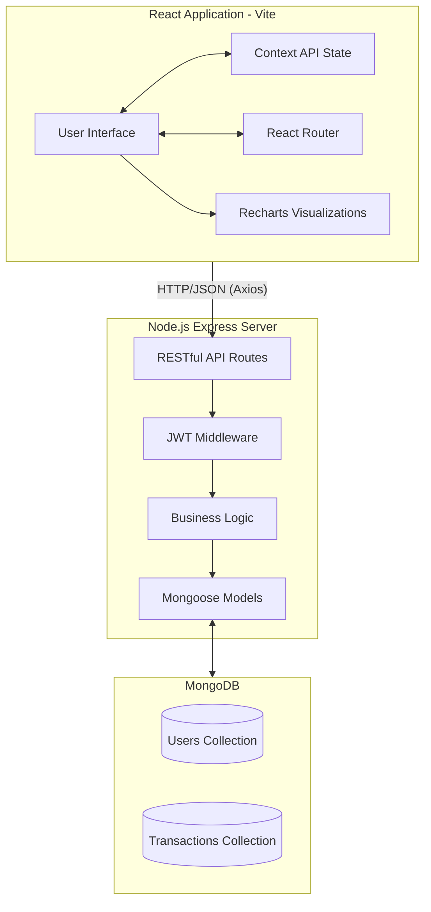

# 💎 Premium Expense Tracker

## 🌟 Introduction
Premium Expense Tracker is a state-of-the-art, modern financial management dashboard designed to help users effortlessly track their income and expenses. It features a stunning split-screen aesthetic, fully dynamic dark and light modes, and beautiful data visualizations. Built with an uncompromising focus on user experience and visual excellence, the application makes personal finance engaging and intuitive.

## 🚀 Live Demo
[**View the Live website Here**](https://expense-tracker-sigma-two-95.vercel.app/login) 

## 🛠️ Tech Stack

### Frontend
- **React 19** - Modern UI component library
- **Vite** - Lightning-fast build tool
- **Tailwind CSS v4** - Utility-first styling with dynamic CSS variables
- **Recharts** - Beautiful, responsive data visualization (Pie charts, Bar charts, Line graphs)
- **React Router Dom** - Client-side routing
- **Context API** - Global state management for authentication and theme toggling

### Backend
- **Node.js & Express 5** - Fast, unopinionated web framework
- **MongoDB & Mongoose 9** - Flexible NoSQL database and object modeling
- **JSON Web Tokens (JWT)** - Secure authentication mechanism
- **BcryptJS** - Password hashing
- **Multer** - File uploading for profile avatars

## 🏛️ Architecture Diagram
Below is the high-level architecture of the application:



## ⚙️ Configuration & Setup

### Prerequisites
- Node.js (v18+)
- MongoDB (Local or Atlas)

### 1. Clone the repository
```bash
git clone <your-repo-url>
cd expense-tracker
```

### 2. Backend Setup
```bash
cd backend
npm install
```
Create a `.env` file in the `backend` directory:
```env
PORT=5000
MONGODB_URI=your_mongodb_connection_string
JWT_SECRET=your_jwt_secret_key
```
Start the backend server:
```bash
npm run dev
```

### 3. Frontend Setup
```bash
cd frontend
npm install
```
Create a `.env` file in the `frontend` directory:
```env
VITE_API_URL=http://localhost:5000/api/v1
```
Start the frontend development server:
```bash
npm run dev
```

## 🚀 Innovation and New Features

- **Premium Split-Screen Auth:** A highly tailored, visually distinct split-screen design on authentication pages matching top-tier fintech apps, featuring a permanent deep-dark premium gradient on the branding section.
- **Dynamic CSS Variable Theming:** Fully decoupled theming engine using native CSS variables integrated directly with Tailwind CSS. It allows for instant, seamless transitions between Light and Dark modes without component re-renders.
- **Glassmorphism Components:** Beautiful translucent cards and modals with soft shadows that give depth and hierarchy to financial data.
- **Unified Analytics Engine:** Interactive and responsive Recharts components that dynamically update colors based on the active theme (e.g., Electric Blue and Violet).
- **Secure File Uploads:** Integrated Multer pipeline for processing and serving customized user avatar images.
